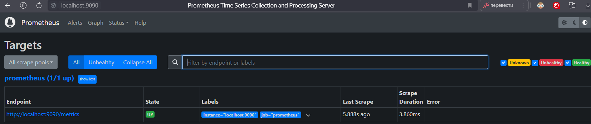
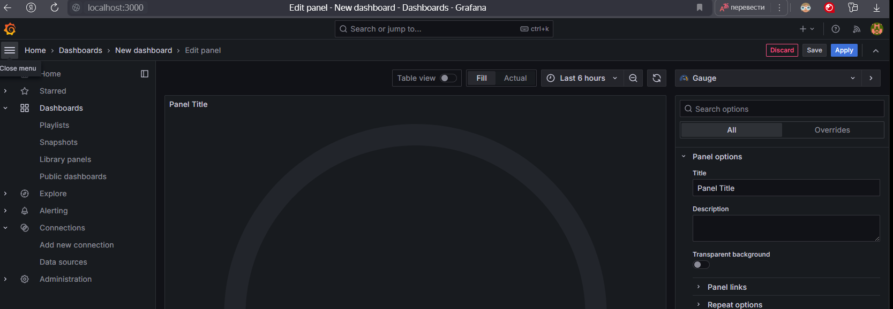
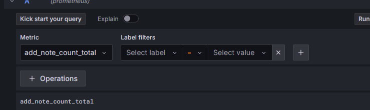
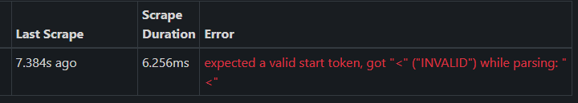
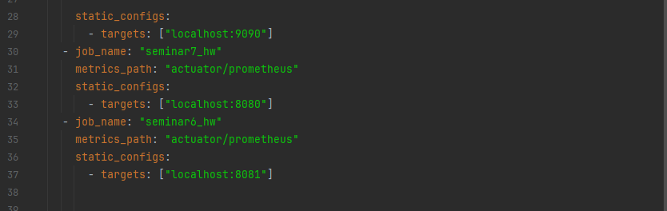
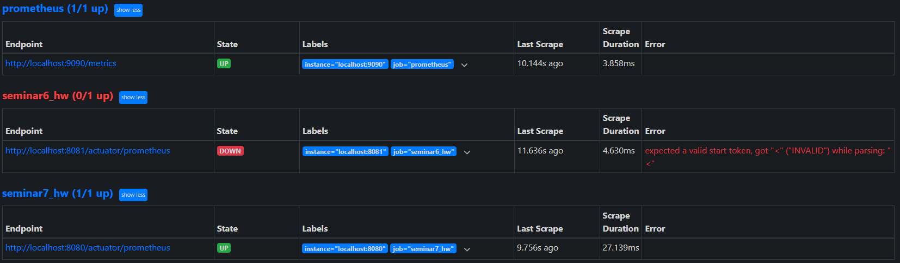

На семинаре установил grafana и prometheus:

При работе на семенаре всё работало и создавались кастомные метрики:

При попытке добавить добавить метрики на другой проект возникала ошибка:

Пробовал переустанавливать и переписывать yaml файл prometheus но ошибка осталась
Далее добавил два проекта в папку вместе с прометеусом
и добавил их в yaml файл прометеуса.

 
В результате запустился один проект из двух:

Но кастомные метрики этого проекта не отображались в grafana
